# Darwin--Elastic-Alert-Triage-Investigation-Lab

## Overview

This project demonstrates a complete Security Operations Center (SOC) investigation using Elastic Security (Kibana) within the TryHackMe **Alert Triage With Elastic** lab.

The investigation covers multiple attack scenarios, including:

- Web attack analysis
- HTTP POST and GET request investigation
- Windows Security Event Log analysis
- Administrator logon investigation
- Sysmon Process Creation events
- Security Group Management events
- PowerShell Script Block Logging (Event ID 4104)
- Privilege Escalation investigation

Throughout the lab, Elastic Discover was used to search, filter, and correlate logs to identify malicious activity and answer investigation questions.

---

## Skills Demonstrated

- Elastic Security
- Kibana Discover
- Security Monitoring
- Threat Hunting
- Windows Event Log Analysis
- Sysmon Investigation
- Event Correlation
- PowerShell Analysis
- Privilege Escalation Detection
- Security Event Investigation
- Blue Team Operations
- SOC Alert Triage

---

## Technologies Used

- Elastic Stack
- Kibana Discover
- Elastic Security
- Sysmon
- Windows Security Logs
- PowerShell
- TryHackMe
- Windows Server
- KQL-style Searching

---

# Investigation Walkthrough

## Screenshot 1 — Alert Triage With Elastic Introduction


Introduces the investigation scenario, objectives, and the Elastic Security environment.

---

## Screenshot 2 — Kibana Discover Interface


Opened Kibana Discover and became familiar with the interface used throughout the investigation.

---

## Screenshot 3 — Kibana Web Logs Loaded

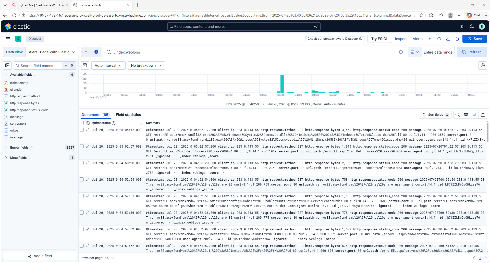

Verified that web server logs were successfully ingested into Elastic for analysis.

---

## Screenshot 4 — Investigating Web Attacks (POST Requests)

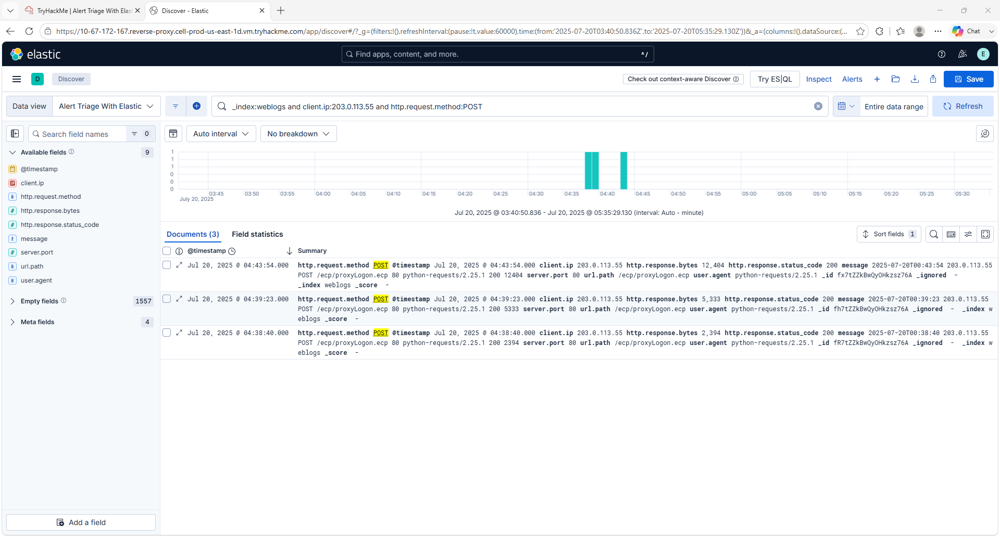

Filtered HTTP POST requests to identify suspicious web attack activity and malicious requests.

---

## Screenshot 5 — GET Request Error Investigation

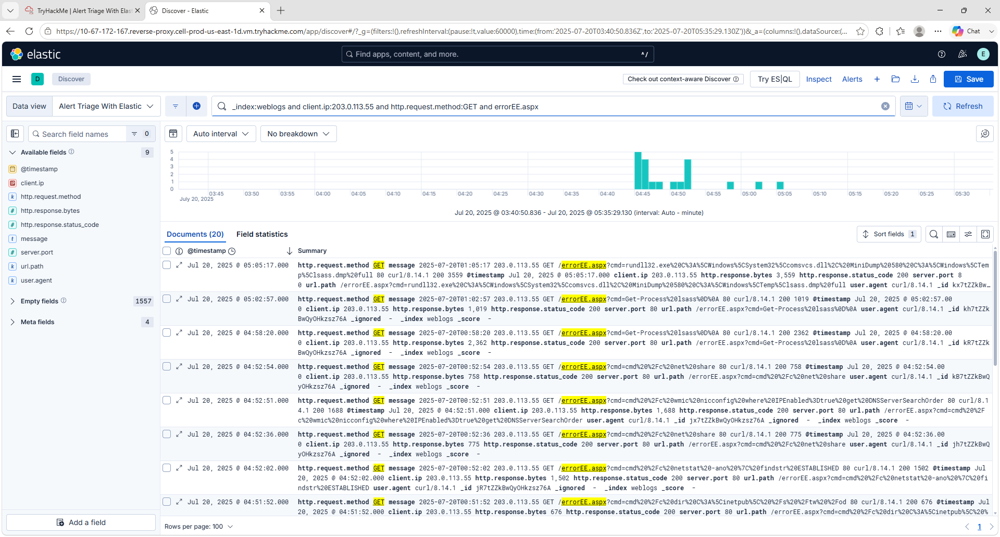

Investigated suspicious HTTP GET requests and server responses to identify abnormal behavior.

---

## Screenshot 6 — Command Execution Investigation

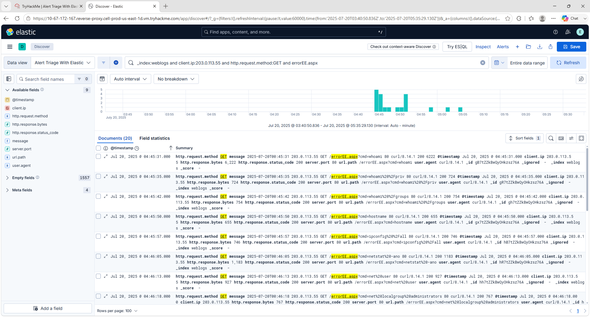

Compared process execution events to identify suspicious command execution activity.

---

## Screenshot 7 — Web Attack Investigation Answers

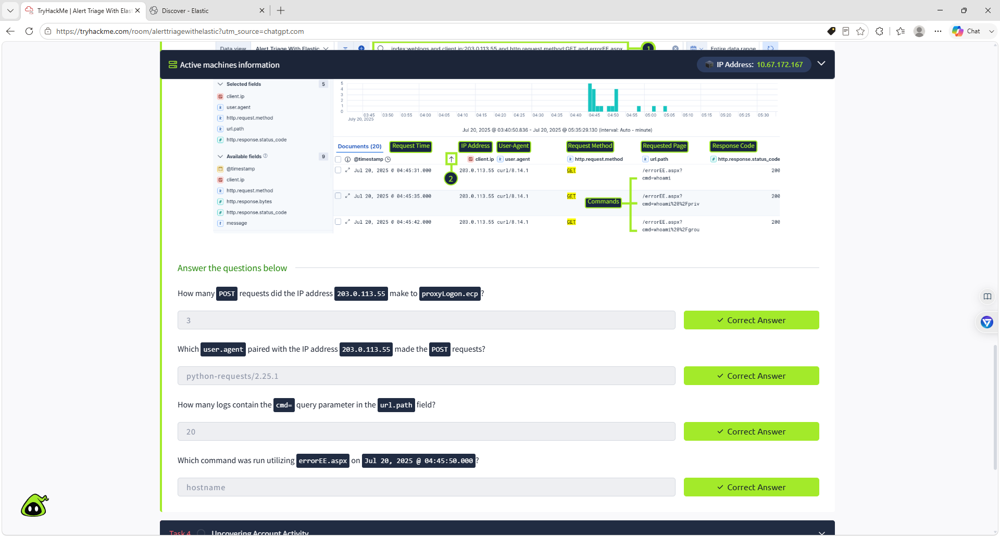

Completed the investigation questions by analyzing web logs and identifying attack indicators.

---

## Screenshot 8 — Administrator Logon Event 4624

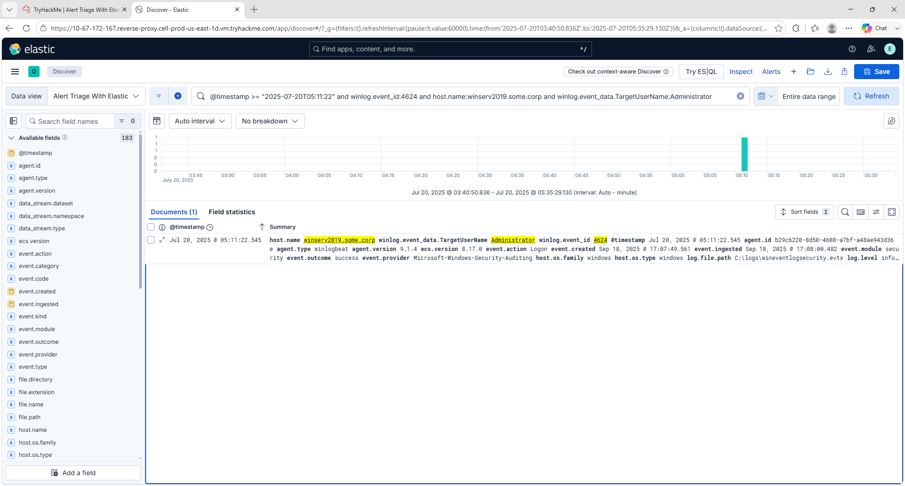

Investigated Windows Security Event ID **4624** to verify successful Administrator authentication.

---

## Screenshot 9 — Task 4 Final Answers

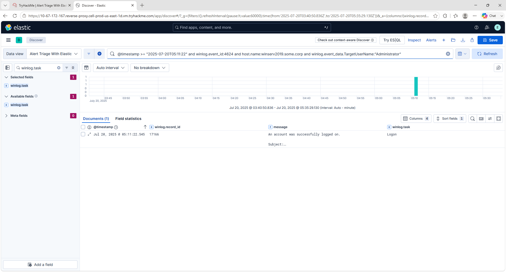

Completed Task 4 by correlating Windows Security events with Sysmon logs.

---

## Screenshot 10 — Command-Line Investigation Query

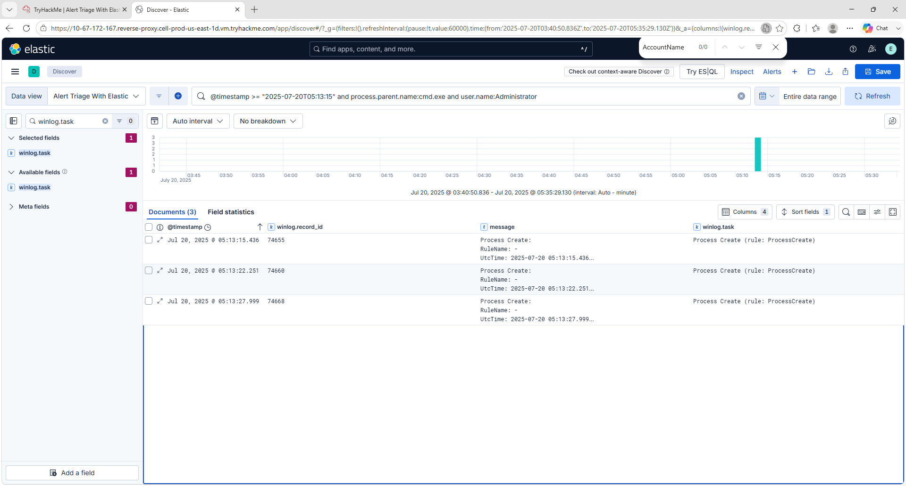

Created and executed search queries to investigate suspicious command-line activity.

---

## Screenshot 11 — Sysmon Process ID 964 Investigation

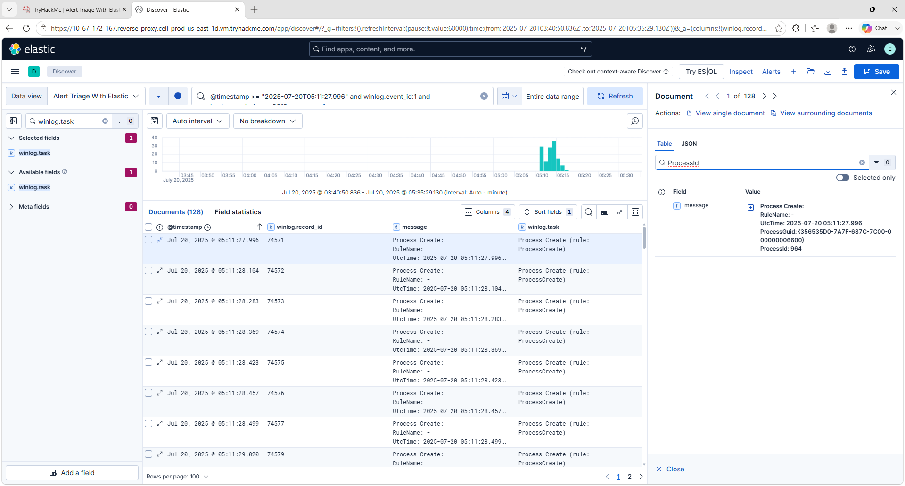

Investigated Sysmon Process Create events and identified Process ID **964** associated with suspicious activity.

---

## Screenshot 12 — Security Group Management Investigation

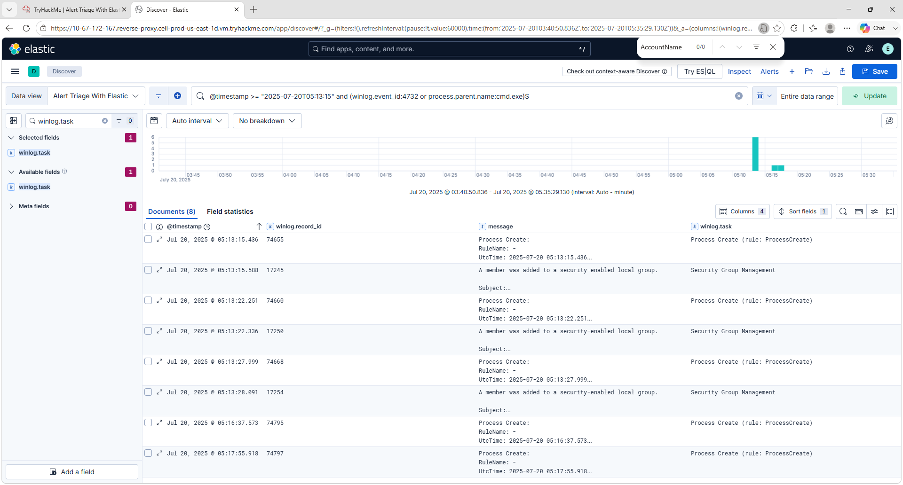

Analyzed Security Group Management events to investigate changes to privileged local groups and correlate them with attacker activity.

---

## Screenshot 13 — PowerShell 4104 Remote Command Investigation

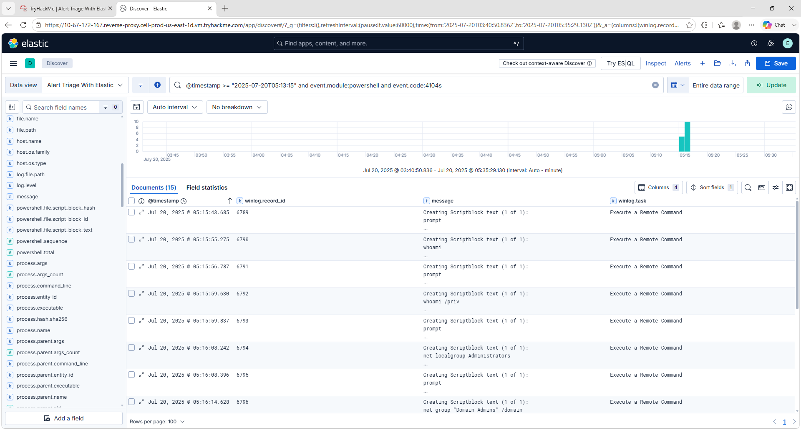

Investigated PowerShell Script Block Logging (Event ID **4104**) to identify remote command execution, privilege enumeration, and administrative commands used during the attack.

---

# Key Takeaways

This lab provided practical experience with:

- Investigating alerts using Elastic Security
- Searching logs in Kibana Discover
- Analyzing Windows Security Events
- Investigating Sysmon Process Creation logs
- Detecting suspicious PowerShell activity
- Correlating multiple event sources
- Identifying privilege escalation techniques
- Performing SOC alert triage
- Documenting investigation findings

---

# Career Skills Demonstrated

- SIEM Operations
- Elastic Security
- Threat Hunting
- Windows Security Monitoring
- Event Correlation
- Incident Investigation
- PowerShell Analysis
- Blue Team Operations
- SOC Tier 1 Analyst Skills
- Security Event Analysis

---

## Repository Structure

```
Elastic-Alert-Triage-Investigation-Lab/
│
├── README.md
└── screenshots/
    ├── 01-Alert-Triage-With-Elastic-Introduction.png
    ├── 02-Kibana-Discover-Interface.png
    ├── 03-Kibana-Weblogs-Loaded.png
    ├── 04-Investigating-Web-Attacks-POST-Requests.png
    ├── 05-Elastic-GET-Requests-Error-Investigation.png
    ├── 06-Elastic-Command-Execution-Old-New.png
    ├── 07-Elastic-Web-Attack-Investigation-Answers.png
    ├── 08-Elastic-Administrator-Logon-Event-4624.png
    ├── 09-Task4-Final-Answers.png
    ├── 10-Elastic-Command-Line-Investigation-Query.png
    ├── 11-Elastic-Sysmon-ProcessID-964.png
    ├── 12-Elastic-Security-Group-Management-Investigation.png
    └── 13-Elastic-PowerShell-4104-Remote-Command-Investigation.png
```

---

# Author

**Darwin Brown JR**

Aspiring SOC Tier 1
