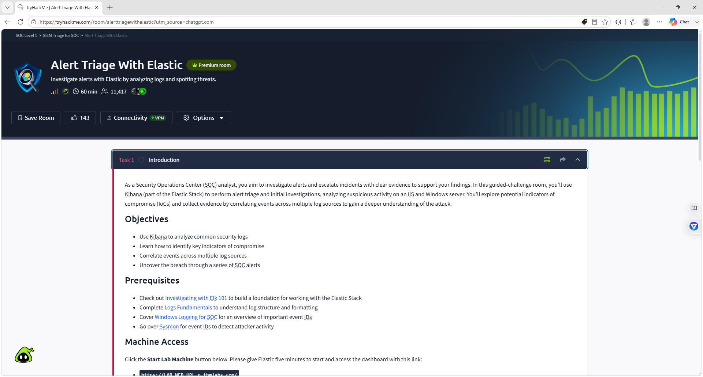
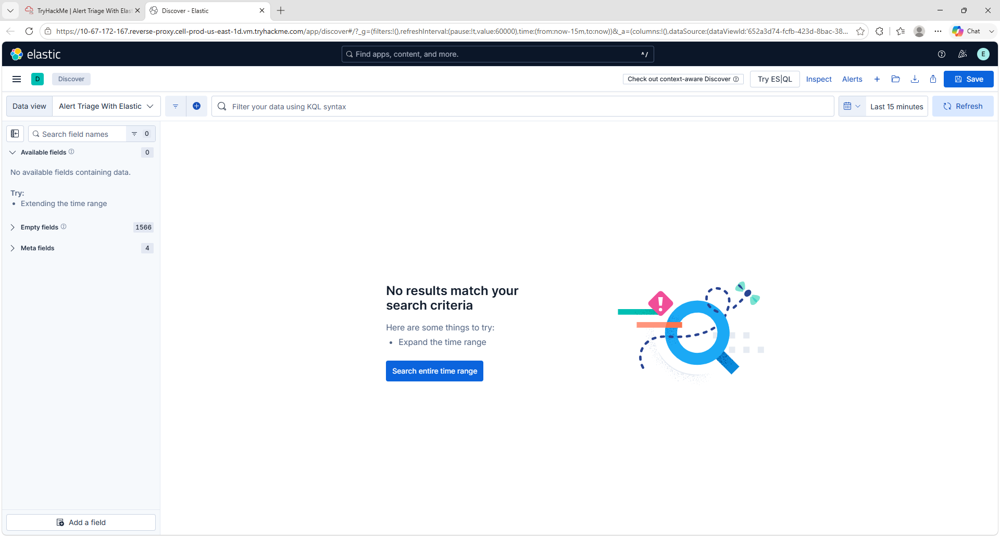

# Darwin--Elastic-Alert-Triage-Investigation-Lab

## Overview

This project demonstrates a complete Security Operations Center (SOC) investigation using Elastic Security (Kibana) within the TryHackMe **Alert Triage With Elastic** lab.

The investigation covers multiple attack scenarios, including:

- Web attack analysis
- HTTP POST and GET request investigation
- Windows Security Event Log analysis
- Administrator logon investigation
- Sysmon Process Creation events
- Security Group Management events
- PowerShell Script Block Logging (Event ID 4104)
- Privilege Escalation investigation

Throughout the lab, Elastic Discover was used to search, filter, and correlate logs to identify malicious activity and answer investigation questions.

---

## Skills Demonstrated

- Elastic Security
- Kibana Discover
- Security Monitoring
- Threat Hunting
- Windows Event Log Analysis
- Sysmon Investigation
- Event Correlation
- PowerShell Analysis
- Privilege Escalation Detection
- Security Event Investigation
- Blue Team Operations
- SOC Alert Triage

---

## Technologies Used

- Elastic Stack
- Kibana Discover
- Elastic Security
- Sysmon
- Windows Security Logs
- PowerShell
- TryHackMe
- Windows Server
- KQL-style Searching

---

# Investigation Walkthrough

## Screenshot 1 — Alert Triage With Elastic Introduction

Introduces the TryHackMe lab objectives and investigation scenario.

---

## Screenshot 2 — Kibana Discover Interface

Opened Kibana Discover and explored the Elastic investigation workspace.

---

## Screenshot 3 — Web Logs Loaded

Verified successful log ingestion and available web server events.

---

## Screenshot 4 — Web Attack POST Request Investigation

Filtered HTTP POST requests to investigate suspicious web attack activity.

---

## Screenshot 5 — GET Request Error Investigation

Analyzed HTTP GET requests and server errors to identify suspicious traffic.

---

## Screenshot 6 — Command Execution Comparison

Compared process execution events to identify suspicious command activity.

---

## Screenshot 7 — Web Attack Investigation Results

Completed the investigation by answering the web attack analysis questions.

---

## Screenshot 8 — Administrator Logon Event 4624

Investigated Windows Security Event ID **4624** to identify successful Administrator logon activity.

---

## Screenshot 9 — Task 4 Investigation Answers

Completed the Windows event investigation by correlating multiple security logs.

---

## Screenshot 10 — Command-Line Investigation Query

Created a focused search query to investigate suspicious command-line execution.

---

## Screenshot 11 — Sysmon Process ID 964 Investigation

Analyzed Sysmon Process Create events and identified **Process ID 964** associated with suspicious activity.

---

## Screenshot 12 — Security Group Management Investigation

Correlated Windows Security Event ID **4732** with Sysmon events to investigate modifications to security-enabled local groups.

---

## Screenshot 13 — PowerShell 4104 Script Block Investigation

Investigated PowerShell Script Block Logging (Event ID **4104**) to analyze executed PowerShell commands.

---

## Screenshot 14 — PowerShell Remote Command Investigation

Examined PowerShell remote command execution and administrative commands used during the investigation, identifying privilege enumeration and potential privilege escalation.
This activity demonstrated privilege enumeration and possible privilege escalation.

---

# What I Learned

During this project I learned how to:

- Investigate security alerts using Elastic Security
- Search Windows Security Event Logs
- Analyze Sysmon Process Create events
- Detect privilege escalation behavior
- Investigate PowerShell activity
- Correlate multiple log sources
- Perform SOC alert triage
- Identify suspicious administrative activity
- Build effective search queries in Kibana Discover

---

# Career Skills Demonstrated

- Security Monitoring
- SIEM Investigation
- Elastic Security
- Windows Event Analysis
- Threat Hunting
- Blue Team Investigation
- Incident Response
- Log Correlation
- Privilege Escalation Detection
- SOC Tier 1 Analysis

---

# Author

**Darwin Brown JR**

Aspiring SOC Tier 1
